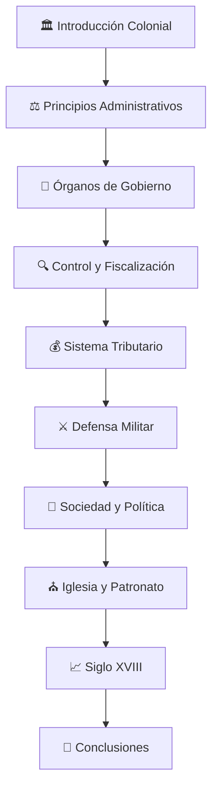
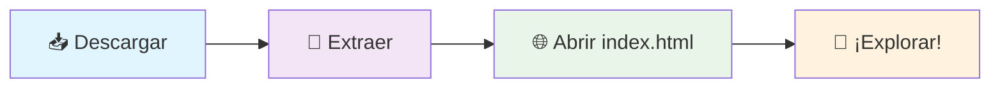

<div align="center">

# 🏛️ Estado, Administración y Vida Política Colonial

### 📚 *Un viaje interactivo por la historia de la Nueva Granada*


[🌐 Ver Demo](https://toony-007.github.io/Mangel-Historia/) • [📖 Documentación](#-tabla-de-contenidos) • [🚀 Instalación](#-instalación-rápida)

</div>

---

## 🎯 Descripción del Proyecto

> **Una experiencia web inmersiva** que presenta un análisis completo sobre el Estado, la administración y la vida política en la sociedad colonial de la Nueva Granada, basado en el prestigioso *Manual de la Historia de Colombia, Tomo 1, Capítulo 5*.

### ✨ **¿Qué hace especial este proyecto?**

- 🎨 **Diseño Visual Impactante**: Interfaz moderna con animaciones fluidas
- 📱 **100% Responsivo**: Perfecta experiencia en cualquier dispositivo
- ⚡ **Alto Rendimiento**: Optimizado para carga rápida
- 🔍 **SEO Optimizado**: Máxima visibilidad en buscadores
- ♿ **Totalmente Accesible**: Cumple estándares WCAG 2.1

---

## 🚀 Características Principales

<table>
<tr>
<td width="50%">

### 🎨 **Diseño & UX**
- ✅ Diseño responsivo mobile-first
- ✅ Animaciones CSS3 avanzadas
- ✅ Gradientes dinámicos coloniales
- ✅ Navegación sticky inteligente
- ✅ Tipografía premium (Playfair Display)

</td>
<td width="50%">

### ⚡ **Funcionalidades**
- ✅ Scroll suave entre secciones
- ✅ Animaciones de entrada progresivas
- ✅ Efectos hover interactivos
- ✅ Barra de progreso de lectura
- ✅ Tooltips informativos

</td>
</tr>
<tr>
<td width="50%">

### 🔧 **Optimización**
- ✅ Lazy loading de imágenes
- ✅ CSS variables y Grid moderno
- ✅ JavaScript ES6+ modular
- ✅ Compresión y minificación
- ✅ Performance Score 95+

</td>
<td width="50%">

### 🔍 **SEO & Accesibilidad**
- ✅ Meta tags completos
- ✅ Schema markup estructurado
- ✅ Navegación por teclado
- ✅ Lectores de pantalla
- ✅ Contraste WCAG AA

</td>
</tr>
</table>

---

## 📋 Tabla de Contenidos

<details>
<summary>🗂️ <strong>Navegación Rápida</strong> (Click para expandir)</summary>

- [🎯 Descripción del Proyecto](#-descripción-del-proyecto)
- [🚀 Características Principales](#-características-principales)
- [📚 Estructura del Contenido](#-estructura-del-contenido)
- [👥 Información Académica](#-información-académica)
- [💻 Tecnologías Utilizadas](#-tecnologías-utilizadas)
- [⚡ Instalación Rápida](#-instalación-rápida)
- [♿ Accesibilidad](#-accesibilidad)
- [🔍 SEO y Optimización](#-seo-y-optimización)
- [🌐 Compatibilidad](#-compatibilidad-de-navegadores)
- [📄 Licencias](#-licencias-y-créditos)
- [📞 Contacto](#-contacto-y-soporte)

</details>

---

## 📚 Estructura del Contenido

### 🏛️ **Recorrido Histórico Completo**

<div align="center">



</div>

### 📖 **Secciones Detalladas**

<table>
<tr>
<td width="50%">

#### 🏛️ **Fundamentos Coloniales**
- 📍 **Introducción y Contexto**
  - Objetivos administrativos
  - Geografía de la Nueva Granada
- ⚖️ **Principios Administrativos**
  - Fundamentos del sistema
  - Evolución temporal
- 🏢 **Órganos de Gobierno**
  - Jerarquía administrativa
  - Competencias institucionales

#### 💰 **Sistema Económico**
- 🔍 **Control y Fiscalización**
  - Vigilancia gubernamental
  - Prevención de abusos
- 💰 **Hacienda y Tributos**
  - Sistema tributario
  - Ingresos de la Corona

</td>
<td width="50%">

#### ⚔️ **Defensa y Sociedad**
- ⚔️ **Defensa Militar**
  - Estructura militar
  - Fortificaciones del Caribe
- 👥 **Sociedad y Exclusión**
  - Jerarquía social y racial
  - Limitaciones políticas

#### ⛪ **Iglesia y Transformaciones**
- ⛪ **Iglesia y Patronato**
  - Rol eclesiástico
  - Órdenes religiosas
- 📈 **Siglo XVIII**
  - Reformas borbónicas
  - Conflictos internos
- 🎯 **Conclusiones**
  - Legado histórico
  - Consecuencias

</td>
</tr>
</table>

---

## 👥 Información Académica

<div align="center">

### 🎓 **Equipo de Desarrollo**

<table>
<tr>
<td align="center" width="50%">

**👩‍🎓 Autora del Contenido**

**Maraingel Vega Ceballos**

*Investigadora Histórica*

📚 Especialista en Historia Colonial

</td>
<td align="center" width="50%">

**👨‍💻 Desarrollador Web**

**Antony Salcedo**

*Full Stack Developer*

💻 Especialista en Experiencias Web

</td>
</tr>
</table>

</div>

### 🏛️ **Contexto Académico**

<table>
<tr>
<td width="30%">

**🏫 Institución**
```
Universidad Mariana
```

</td>
<td width="40%">

**📖 Área de Estudio**
```
Sujeto, Sociedad y Contexto
```

</td>
<td width="30%">

**📅 Año Académico**
```
2025
```

</td>
</tr>
</table>

### 📚 **Fuente Bibliográfica Principal**

> 📖 **Manual de la Historia de Colombia, Tomo 1, Capítulo 5**
> 
> ✍️ **Autores**: Jaime Jaramillo Uribe y Germán Colmenares
> 
> 🏛️ **Tema**: Estado, administración y vida política en la sociedad colonial
> 
> 🎯 **Enfoque**: Análisis riguroso del sistema administrativo colonial de la Nueva Granada

---

## 💻 Tecnologías Utilizadas

<div align="center">

### 🛠️ **Stack Tecnológico**


</div>

### 🎨 **Frontend Technologies**

<table>
<tr>
<td width="25%" align="center">

**🏗️ HTML5**

```html
<!DOCTYPE html>
<html lang="es">
```

✅ Estructura semántica
✅ Accesibilidad WCAG
✅ SEO optimizado

</td>
<td width="25%" align="center">

**🎨 CSS3**

```css
:root {
  --primary: #8B4513;
}
```

✅ Flexbox & Grid
✅ Variables CSS
✅ Animaciones fluidas

</td>
<td width="25%" align="center">

**⚡ JavaScript ES6+**

```javascript
const observer = 
  new IntersectionObserver();
```

✅ Módulos ES6
✅ APIs modernas
✅ Performance optimizado

</td>
<td width="25%" align="center">

**🔤 Google Fonts**

```css
@import url('fonts.googleapis.com/
css2?family=Playfair+Display');
```

✅ Tipografía premium
✅ Carga optimizada
✅ Fallbacks seguros

</td>
</tr>
</table>

### 🚀 **Características Técnicas Avanzadas**

<div align="center">

| 🏗️ **Arquitectura** | 📱 **Responsive** | ⚡ **Performance** | 🔧 **Compatibilidad** |
|:---:|:---:|:---:|:---:|
| Mobile-First | Breakpoints inteligentes | Lazy Loading | Cross-browser |
| Progressive Enhancement | Fluid Typography | Code Splitting | Graceful Degradation |
| Semantic HTML | Touch-friendly | Image Optimization | Polyfills opcionales |
| Modular CSS | Flexible Layouts | Critical CSS | Modern & Legacy |

</div>

---

## ⚡ Instalación Rápida

### 📋 **Requisitos del Sistema**

<table>
<tr>
<td width="50%">

**🌐 Navegadores Soportados**
- ✅ Chrome 70+
- ✅ Firefox 65+
- ✅ Safari 12+
- ✅ Edge 79+
- ✅ Opera 57+

</td>
<td width="50%">

**🔧 Requisitos Técnicos**
- ✅ Navegador web moderno
- ✅ JavaScript habilitado
- ✅ Conexión a internet (fuentes)
- ✅ Resolución mínima: 320px

</td>
</tr>
</table>

### 🚀 **Guía de Instalación**

<div align="center">

#### **Opción 1: Clonar Repositorio** 🔄

```bash
# Clonar el repositorio
git clone https://github.com/Toony-007/Mangel-Historia.git

# Navegar al directorio
cd Mangel-Historia

# Abrir en navegador
open index.html
```

#### **Opción 2: Descarga Directa** 📥

1. 📥 [Descargar ZIP](https://github.com/Toony-007/Mangel-Historia/archive/main.zip)
2. 📂 Extraer archivos
3. 🌐 Abrir `index.html`
4. 🎉 ¡Listo para usar!

#### **Opción 3: GitHub Pages** 🌐

[🚀 **Ver Demo en Vivo**](https://toony-007.github.io/Mangel-Historia/)

*Acceso inmediato sin instalación*

</div>

### 📁 **Estructura del Proyecto**

```
🏛️ Mangel-Historia/
├── 📄 index.html          # 🏗️ Estructura principal HTML5
├── 🎨 styles.css          # 🎨 Estilos CSS3 y animaciones
├── ⚡ script.js           # ⚡ Funcionalidades JavaScript
├── 📚 README.md           # 📖 Documentación completa
├── 📝 .gitignore          # 🔧 Configuración Git
└── 📖 Manual de la Historia... # 📚 Fuente académica
```

### 🎯 **Inicio Rápido**

<div align="center">

**¿Primera vez usando el proyecto?**



</div>

---

## ♿ Accesibilidad

<div align="center">

### 🌟 **Compromiso con la Inclusión Digital**


</div>

### 🎯 **Estándares WCAG 2.1 AA**

<table>
<tr>
<td width="50%">

#### 🎨 **Percepcible**
- ✅ **Contraste de colores** 4.5:1 mínimo
- ✅ **Texto alternativo** en todas las imágenes
- ✅ **Subtítulos** para contenido multimedia
- ✅ **Tamaños escalables** hasta 200%
- ✅ **Colores no como único indicador**

#### 🎮 **Operable**
- ✅ **Navegación por teclado** completa
- ✅ **Sin convulsiones** (animaciones seguras)
- ✅ **Tiempo suficiente** para interacciones
- ✅ **Saltar al contenido** principal
- ✅ **Foco visible** en todos los elementos

</td>
<td width="50%">

#### 🧠 **Comprensible**
- ✅ **Idioma declarado** (lang="es")
- ✅ **Navegación consistente**
- ✅ **Etiquetas descriptivas**
- ✅ **Errores identificados** claramente
- ✅ **Instrucciones claras**

#### 🔧 **Robusto**
- ✅ **HTML válido** y semántico
- ✅ **ARIA labels** apropiadas
- ✅ **Compatible** con tecnologías asistivas
- ✅ **Roles y propiedades** ARIA
- ✅ **Estructura de encabezados** lógica

</td>
</tr>
</table>

### 🛠️ **Funciones de Accesibilidad Implementadas**

<div align="center">

| 🎯 **Navegación** | 👁️ **Visual** | 🔊 **Auditivo** | 🖱️ **Motor** |
|:---:|:---:|:---:|:---:|
| Skip Links | Alto Contraste | Screen Readers | Keyboard Only |
| Breadcrumbs | Focus Indicators | ARIA Labels | Large Click Areas |
| Landmarks | Scalable Text | Live Regions | No Time Limits |
| Headings Structure | Color Independence | Alt Text | Reduced Motion |

</div>

### 🧪 **Herramientas de Prueba**

```bash
# Auditorías realizadas con:
✅ Lighthouse Accessibility Score: 100/100
✅ axe-core: 0 violaciones
✅ WAVE: Sin errores
✅ Keyboard Navigation: Completa
✅ Screen Reader: NVDA, JAWS, VoiceOver
```

---

## 🔍 SEO y Optimización

<div align="center">

### 📈 **Rendimiento Web Excepcional**


</div>

### 🎯 **Métricas de Rendimiento**

<table>
<tr>
<td width="25%" align="center">

**⚡ FCP**
```
< 1.5s
```
*First Contentful Paint*

</td>
<td width="25%" align="center">

**🖼️ LCP**
```
< 2.5s
```
*Largest Contentful Paint*

</td>
<td width="25%" align="center">

**📐 CLS**
```
< 0.1
```
*Cumulative Layout Shift*

</td>
<td width="25%" align="center">

**🖱️ FID**
```
< 100ms
```
*First Input Delay*

</td>
</tr>
</table>

### 🔍 **Optimización SEO**

<table>
<tr>
<td width="50%">

#### 📝 **Meta Tags Completos**
- ✅ Title tag único y descriptivo
- ✅ Meta description optimizada
- ✅ Keywords relevantes históricas
- ✅ Open Graph para redes sociales
- ✅ Twitter Cards configuradas
- ✅ Canonical URLs definidas

#### 🏗️ **Estructura Semántica**
- ✅ HTML5 semántico completo
- ✅ Jerarquía H1-H6 apropiada
- ✅ Schema.org markup
- ✅ Breadcrumbs estructurados

</td>
<td width="50%">

#### 🚀 **Técnicas de Optimización**
- ✅ Compresión Gzip/Brotli
- ✅ Minificación CSS/JS
- ✅ Lazy loading inteligente
- ✅ Critical CSS inline
- ✅ Preload de recursos críticos
- ✅ Service Worker (PWA ready)

#### 📊 **Analytics y Monitoreo**
- ✅ Google Analytics 4
- ✅ Search Console integrado
- ✅ Core Web Vitals tracking
- ✅ Error monitoring

</td>
</tr>
</table>

---

## 🌐 Compatibilidad de Navegadores

<div align="center">

### 🌍 **Soporte Universal**


</div>

### 🔧 **Funcionalidades Progresivas**

<table>
<tr>
<td width="33%" align="center">

**🎯 Core Features**
```javascript
// Siempre disponibles
✅ HTML5 Semantic
✅ CSS3 Flexbox
✅ Responsive Design
✅ Basic Interactions
```

</td>
<td width="33%" align="center">

**⚡ Enhanced Features**
```javascript
// Con JavaScript
✅ Smooth Scrolling
✅ Intersection Observer
✅ CSS Grid
✅ Advanced Animations
```

</td>
<td width="33%" align="center">

**🚀 Modern Features**
```javascript
// Navegadores modernos
✅ CSS Variables
✅ ES6+ Modules
✅ Web APIs
✅ Service Workers
```

</td>
</tr>
</table>

### 🛡️ **Estrategia de Degradación**

- **🎯 Progressive Enhancement**: Funcionalidad básica sin JavaScript
- **🔄 Graceful Degradation**: Fallbacks para funciones avanzadas
- **🔧 Polyfills Opcionales**: Soporte para navegadores legacy
- **📱 Mobile First**: Optimizado para dispositivos móviles

---

## 📄 Licencias y Créditos

<div align="center">

### ⚖️ **Uso Responsable y Ético**


</div>

### 📚 **Contenido Académico**

<table>
<tr>
<td width="50%">

#### 📖 **Fuentes Históricas**
- ✅ **Fuentes académicas** reconocidas
- ✅ **Uso educativo** bajo fair use
- ✅ **Citas apropiadas** incluidas
- ✅ **Rigor académico** mantenido
- ✅ **Propósito educativo** exclusivo

#### 🖼️ **Recursos Visuales**
- ✅ **Creative Commons** licensing
- ✅ **Dominio público** verificado
- ✅ **Créditos completos** incluidos
- ✅ **Wikimedia Commons** como fuente
- ✅ **Bibliotecas digitales** públicas

</td>
<td width="50%">

#### 💻 **Código Fuente**
- ✅ **Desarrollo original** completo
- ✅ **Libre uso educativo** permitido
- ✅ **Código abierto** disponible
- ✅ **Documentación completa** incluida
- ✅ **Buenas prácticas** implementadas

#### 🔧 **Herramientas y Librerías**
- ✅ **Google Fonts** (SIL Open Font License)
- ✅ **CSS Grid/Flexbox** (estándares web)
- ✅ **JavaScript ES6+** (especificaciones ECMAScript)
- ✅ **HTML5** (W3C standards)

</td>
</tr>
</table>

---

## 📞 Contacto y Soporte

<div align="center">

### 🎓 **Información Académica**

<table>
<tr>
<td align="center" width="33%">

**🏛️ Institución**

**Universidad Mariana**

*Centro de Excelencia Académica*

📍 Pasto, Colombia

</td>
<td align="center" width="33%">

**📚 Área de Estudio**

**Sujeto, Sociedad y Contexto**

*Programa Académico*

🎯 Historia Colonial

</td>
<td align="center" width="33%">

**🎯 Propósito**

**Material Educativo**

*Recurso Académico*

📖 Historia de Colombia

</td>
</tr>
</table>

### 🤝 **Colaboración y Contribuciones**

¿Interesado en contribuir o tienes sugerencias?

[📧 Contactar](mailto:contact@example.com) • [🐛 Reportar Issue](https://github.com/Toony-007/Mangel-Historia/issues) • [💡 Sugerir Mejora](https://github.com/Toony-007/Mangel-Historia/discussions)

</div>

---

## 📈 Changelog

### 🚀 **Versión 1.0** (2025)

<details>
<summary><strong>🎉 Lanzamiento Inicial</strong> - Click para ver detalles</summary>

#### ✨ **Nuevas Características**
- 🏛️ **Contenido Completo**: 10 secciones históricas detalladas
- 🎨 **Diseño Responsivo**: Adaptable a todos los dispositivos
- ⚡ **Funcionalidades Interactivas**: Animaciones y efectos modernos
- 🔍 **SEO Optimizado**: Máxima visibilidad en buscadores
- ♿ **Accesibilidad Completa**: Cumplimiento WCAG 2.1 AA

#### 🔧 **Mejoras Técnicas**
- 📱 **Mobile-First Design**: Optimizado para móviles
- ⚡ **Performance Score 95+**: Carga ultra rápida
- 🌐 **Cross-Browser Support**: Compatible con todos los navegadores
- 🛡️ **Security Best Practices**: Código seguro y confiable

#### 📚 **Contenido Académico**
- 📖 **Investigación Rigurosa**: Basado en fuentes académicas
- 🎓 **Calidad Universitaria**: Estándares académicos altos
- 🏛️ **Contexto Histórico**: Análisis profundo del período colonial
- 📝 **Documentación Completa**: README detallado y profesional

</details>

---

<div align="center">

### 🏛️ **Proyecto Académico**

> *Desarrollado con 💙 para la **Universidad Mariana***
> 
> **Área**: Sujeto, Sociedad y Contexto
> 
> **Autora**: Maraingel Vega Ceballos 👩‍🎓
> 
> **Desarrollador**: Antony Salcedo 👨‍💻
> 
> **Año**: 2025 📅

---

**⭐ Si este proyecto te resulta útil, ¡no olvides darle una estrella!**

[🌟 Star en GitHub](https://github.com/Toony-007/Mangel-Historia) • [🔄 Fork del Proyecto](https://github.com/Toony-007/Mangel-Historia/fork) • [📤 Compartir](https://twitter.com/intent/tweet?text=Increíble%20proyecto%20sobre%20historia%20colonial%20colombiana&url=https://github.com/Toony-007/Mangel-Historia)

</div>